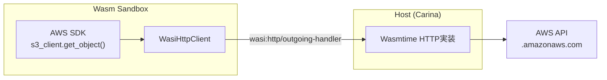

[Carina](https://github.com/carina-rs/carina)のProvider Pluginの仕組みについて書いておく。最初はTerraformと同じプロセスベースの方式で実装し、その後Wasmに移行した。

---

## Terraformのprovider plugin

Terraformのproviderは、[go-plugin](https://github.com/hashicorp/go-plugin)というフレームワークを使って、外部プロセスとして動作する。Terraform本体がproviderのバイナリを子プロセスとして起動し、gRPCで通信する仕組みになっている。

---

## Carinaでも同じ方式で実装した

Carinaでは当初、providerのコードがcarina-cli本体に直接組み込まれていた。これをTerraformと同じアプローチで外部プロセスに分離した。providerを子プロセスとして起動し、stdin/stdoutでJSON-RPCを使って通信する方式。

```
Carina (Host)                    Provider (Child Process)
    |                                    |
    |-- spawn process ------------------>|
    |                                    |-- ready
    |-- JSON-RPC: {"method":"create"} -->|
    |                                    |-- calls AWS SDK directly
    |<-- JSON-RPC: {"result": State} ----|
    |                                    |
    |-- JSON-RPC: {"method":"shutdown"}->|
    |                                    |-- exit
```

実装は3つのクレートに分けた。

- **carina-plugin-host** — プロセスの起動とJSON-RPCクライアント
- **carina-plugin-sdk** — provider開発者向けのSDK。`CarinaProvider`トレイトを実装して`carina_plugin_sdk::run()`を呼ぶだけでproviderになる
- **carina-provider-protocol** — JSON-RPCメッセージの型定義

この方式で、aws providerとawscc providerをそれぞれ外部プロセスとして動作させるところまで実装した。

---

## Wasmへの移行

プロセスベースで動くようにはなったが、Wasmに興味があったので、providerをWasmに移行することにした。

```
carina-cli
  └── WasmProviderFactory (carina-plugin-host)
        └── Wasmtime runtime
              └── Wasm Component (.wasm)
                    ├── CarinaProvider WIT interface
                    └── wasi:http/outgoing-handler (AWS API呼び出し用)
```

実用的なメリットもある。OS/arch別の6+バイナリが単一の`.wasm`ファイルになるので、配布が楽になる。WASIのサンドボックスにより、providerのファイルシステムやネットワークアクセスを制限できるのもいい。

### WIT (Wasm Interface Types) によるインターフェース定義

プロセスベースではJSON-RPCでメッセージを交換していたが、WasmではWITでインターフェースを定義する。

```wit
interface provider {
    use types.{ resource-id, state, resource-def, value };

    info: func() -> string;
    schemas: func() -> string;

    validate-config: func(attrs: list<tuple<string, value>>) -> result<_, string>;
    initialize: func(attrs: list<tuple<string, value>>) -> result<_, string>;

    read: func(id: resource-id, identifier: option<string>) -> result<state, string>;
    create: func(res: resource-def) -> result<state, string>;
    update: func(id: resource-id, identifier: string, current: state, to: resource-def) -> result<state, string>;
    delete: func(id: resource-id, identifier: string, options: string) -> result<_, string>;
}
```

プロセスベースのJSON-RPCと比べると、通信プロトコル自体がWITで定義されるようになった。ただし、WITは再帰的な型をサポートしていないため、ListやMapの値はJSON文字列としてやり取りしている。

### WasmからのHTTPアクセス

Wasmはサンドボックス環境なので、OSのシステムコール（TCPソケットなど）に直接アクセスできない。ネイティブのHTTPクライアントはOSのソケットAPIに依存しているため、そのままではWasm内で動かない。

代わりに、WASIが提供する`wasi:http/outgoing-handler`というインターフェースを使う。provider内のHTTPリクエストはこのインターフェースを通じてホスト側に委譲され、ホスト側が実際のHTTP通信を行う。



AWS SDKはHTTPクライアントを差し替え可能な設計になっているので、`#[cfg(target_arch = "wasm32")]`で条件分岐し、Wasmビルド時だけ`wasi:http/outgoing-handler`を使う`WasiHttpClient`を差し込んでいる。

```rust
#[cfg(not(target_arch = "wasm32"))]
async fn build_config(region: &str) -> aws_config::SdkConfig {
    aws_config::defaults(aws_config::BehaviorVersion::latest())
        .region(Region::new(region.to_string()))
        .load()
        .await
}

#[cfg(target_arch = "wasm32")]
async fn build_config(region: &str) -> aws_config::SdkConfig {
    use carina_plugin_sdk::wasi_http::WasiHttpClient;
    aws_config::defaults(aws_config::BehaviorVersion::latest())
        .region(Region::new(region.to_string()))
        .http_client(WasiHttpClient::new())
        .load()
        .await
}
```

この差し替えだけで、AWS SDKの呼び出しコード（`s3_client.get_object()`など）自体は変更不要。

通信がすべてホスト側を経由するということは、ホスト側でアクセス先を制御できるということでもある。

### Carina側で追加している制限

プロセスベースの方式では、providerはネイティブバイナリとして動作するので、ファイルシステムやネットワークに自由にアクセスできる。ホスト側でそれを制限する手段がない。Wasmに移行したことで、providerに対して以下のような制限をかけられるようになった。

- **HTTP許可リスト** — `.amazonaws.com`ドメインとEC2/ECSメタデータエンドポイントのみアクセス可能
- **メモリ制限** — 256MB上限
- **タイムアウト** — 各操作に30秒のepochベースタイムアウト
- **ソケット排除** — `wasi:sockets`は提供しない
- **環境変数** — AWS認証情報関連のみ許可リストで公開

ファイルシステムアクセスも一切許可していない。AWSの認証情報はホスト側で取得し、環境変数としてWasm環境に明示的に渡す。

### プリコンパイルキャッシュ

Wasmの初回ロードは`.wasm`ファイルのコンパイルが必要だが、2回目以降はプリコンパイル済みの`.cwasm`ファイルをキャッシュして使う。

```
~/.carina/providers/
  └── github.com/carina-rs/carina-provider-aws/
      └── v0.5.0/
          ├── carina-provider-aws.wasm      # オリジナル
          └── carina-provider-aws.cwasm     # プリコンパイル済み
```

`.cwasm`はWasmtimeのバージョンに依存するので、Wasmtimeのバージョンが変わったら再生成する。

---

## 現状

現時点では、aws providerとawscc providerの両方がWasmで動作している。プロセスベースの実装はすでに削除済み。

Wasmへの移行は単純に技術的な興味からだったが、結果的にサンドボックスによるセキュリティが手に入ったのはよい副産物だった。サードパーティproviderを受け入れる上で、providerのコードが任意のファイルやネットワークにアクセスできないことが保証されているのは安心感がある。
